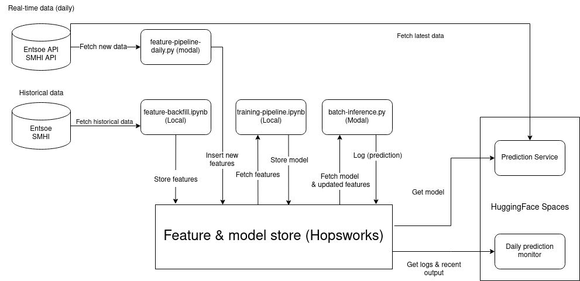
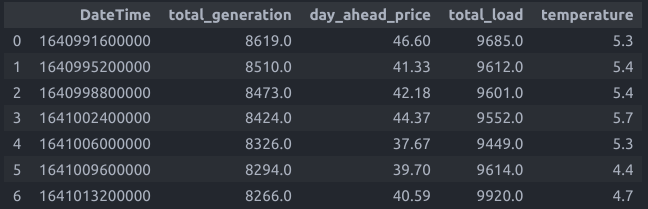
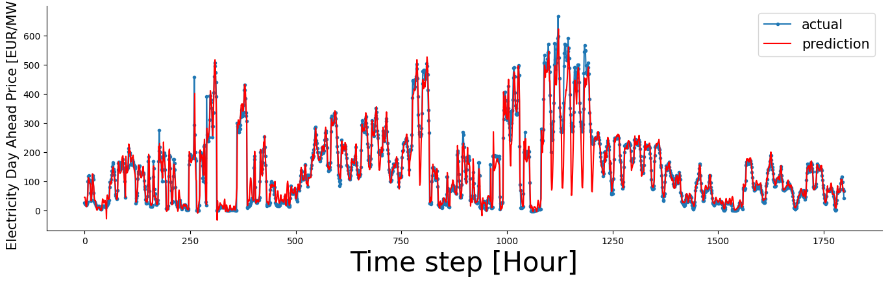

# Project: Electricity Price Prediction in SE3 region, Sweden

## Intro
The purpose with this project is to apply the knowledge and expereinces gained from the course to build a Scalable Prediction Service, using real-time and historical data of electricity prices in the [SE3 electricity region](https://www.svk.se/om-kraftsystemet/om-elmarknaden/elomraden/). The price is affected by electricity supply and demand or environmental (colder climates). 

## Data Sources
The dataset consists of hourly measurements of historical electricity generation and consumption, temperature of Gothenburg and day-ahead electricity prices for the year 2022 (1 Jan - 31 Dec). The data was obtained from the following sources:

- Entsoe: Historical data on energy generation per production type, consumption and day-ahead price. Real-time data was obtained through an API Entsoe provided for registered users. 
- SMHI API: Historical and real-time data on temperature.

## Tools
- Python: Programming Language.
- Libraries: Pandas, numpy, seaborn, matplotlib e.g for data exploration and feature engineering.
- Hopsworks: Storing feature groups and models
- Modal: Schedule pipelines
- Tensorflow: Building ML models.
- Hugging Face: UI for model inference.

## Architecture
The prediction service consists of several independent pipelines: feature, training and inference pipelines. For feature storage and model registry, Hopsworks was used. For scheduling feature retrieval and batch inference, two python scripts were deployed and scheduled to run daily on Modal. For online inference and monitoring, Two applications were deployed on HuggingFace Spaces. The following diagram describes the architecture

## Pipelines 

The prediction services can be described in the following pipelines, each available in this folder.

### Feature Pipeline
This pipeline fetches hourly data from the year 2022. The data consits of generation per production type (hydro, nuclear, wind etc), consumption (as load), day-ahead prices and hourly temperature from Gothenburg. All of the data type float

The following was done for each dataset: 

* Create a common 'datetime' column for joining the data
* Drop irrelevant or redundant columns. 

In the case of electricity generation, the measures of different electricty production types were aggregated as a new colum representing the total generation per hour. 

Lastly, the code uses linear interpolation to fill rows with nan and removes duplicates before uploading the data as a feature group to hopsworks.

### Feature Daily 

For generating daily features, a python function was implemented and sheduled to run daily using the cloud service [Modal](https://modal.com/). At each run, the script does the following:

* Get the date of yesterday, this is done in order to fetch a full 24-hour data batch.
* Fetch the hourly data for eletricity generation, consumption, day-ahead and load. This was done using the [Entsoe api](https://transparency.entsoe.eu/content/static_content/Static%20content/web%20api/Guide.html), which requires an API key and [Entsoe-py python client](https://github.com/EnergieID/entsoe-py), installed as a dependency.
* Retrieve the earliest and latest timestamp from the entsoe dataset and use it to fetch the temperature for Gothenburg in the same time interval as the electricity data. The [SMHI metrological API](https://opendata.smhi.se/apidocs/metobs/index.html) was used in which a simple endpoint is provided.
* Combine and clean the final data, making sure it has the same datatype and names as the feature group.
* Upload the new feature data to an existing feature group in hopsworks

Note that the API key can be obtained by creating an account in the Transparency platform and sending a request through mail, see here for [details](https://transparency.entsoe.eu/content/static_content/download?path=/Static%20content/API-Token-Management.pdf)

## Training Pipeline
The model of choice for this project is Long short-term memory (LSTM). The reason being that a Recurrent Nerual Network (RNN) such as LSTM can process sequences of multiple data entries, which is necessary for this particular prediction service. 

The LSTM model was created using the following libraries from Keras: keras.models.Sequential to initialize the neural network, keras.layers.LSTM to add the LSTM layer, keras.layers.Dense for the densely connected layer. 

The initial step is to collect the data from Hopsworks feature store. The dataset is split into a train- and a test dataset using a 80/20 split. Since the LSTM model requires the input shape in the form of a 3D array, a step in which we reshape the data into the following shape: the number of samples, 24 timesteps and the number of features. Furthermore normalization is applied using StandardScaler. 

When improving the models performance a datacentric approach was chosen. Aggregating the columns of electricity production per type: hydro_water_reservoir,	nuclear, other, solar and wind_onshore into one column seemed to reduce noise in the data and resulted in more accurate predictions. When evaluating the model with the test data the following metrics were achieved: 

R2 Score:  0.9061
MAE:  21.0565
mean_squared_error testing :  39.6613

The below plot depicts the predicted day-ahead price vs. the actual day-ahead price at an hourly interval for the test data: 

The final step of the training pipeline is to save and upload the trained model to Hopsworks Model Registry.

## Inference pipeline
The inference pipeline runs on a daily basis where the initial step is to retrieve the model from Hopsworks Model Registry, and fetching the most recently updated 48 hours of data from Hopsworks feature store. Similarly to the feature daily pipeline, it relies on Modal to schedule the function on a daily basis. The script generates a one day (24 hours) ahead prediction of the SE3 electricity price. Furthermore, a 24 hours of day ahead electricity prices forecast produced by entsoe is fetched via the Entsoe API (See daily feature pipeline). 

The predictions and the Entsoe forecast is combined and uploaded to a new feature group for monitoring predictions. To asses the accuracy of our predicitions the two are plotted for comparision. Additionally the Mean Absolute Error and the Root Mean Squared Error between the two is also computed. displayed in the UI. All plots are displayed in the Monitoring UI.

## UI Links
* Prediction service: https://huggingface.co/spaces/AbyelT/Electricity_Price
* Monitoring UI: https://huggingface.co/spaces/AbyelT/Electricty_Price_Monitoring
* Note: The UI shows three input boxes for unknown reasons, click on "generate" to get the daily forecast
  
